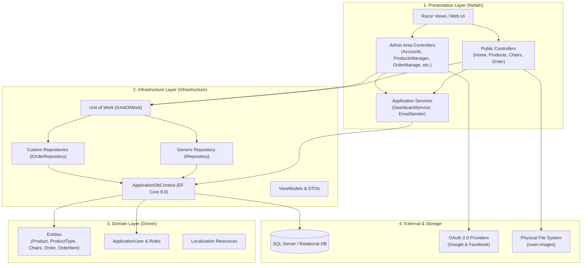

# 🚀 Nafath (نفاذ) - Project Architecture & Documentation

<p align="center">
  
</p>

## 📌 Overview

**Nafath** is a full-featured E-Commerce and Product Management Web Application built on **ASP.NET Core 9.0** utilizing a clean **N-Layered Architecture** alongside the **Repository Pattern** and **Unit of Work**. The system supports multi-role authentication (SuperAdmin, Admin, User), product and catalog administration, session-based shopping cart management, order tracking, and interactive dashboard analytics.

---

## 🏗️ Architecture Overview

The solution is divided into three distinct projects adhering to clean architecture principles and separation of concerns:

```
                      ┌─────────────────────────────────────────┐
                      │             Nafath (Web App)            │
                      │  - Controllers & Admin Area             │
                      │  - Views (Razor / Bootstrap / Toastr)   │
                      │  - Services & Middleware Setup          │
                      └────────────────────┬────────────────────┘
                                           │
                                           ▼
                      ┌─────────────────────────────────────────┐
                      │          Infrastructure Layer           │
                      │  - ApplicationDbContext (EF Core 9.0)   │
                      │  - Repository Pattern & Unit of Work    │
                      │  - ViewModels & DTOs                    │
                      │  - Migrations & Data Seeders            │
                      └────────────────────┬────────────────────┘
                                           │
                                           ▼
                      ┌─────────────────────────────────────────┐
                      │              Domin Layer                │
                      │  - Business Entities & Models           │
                      │  - Identity Roles & User Specifications │
                      │  - Localization Resources (.resx)       │
                      └─────────────────────────────────────────┘
```

---

## 📊 System Architecture Diagram



---

## 📂 Project Structure & Solution Details

```
Nafath/
├── 📁 Domin/                                 # Domain Layer (Core Domain Logic & Entities)
│   ├── 📁 Entity/                           # Data Domain Models
│   │   ├── ApplicationUser.cs               # Extended Identity User Model
│   │   ├── Product.cs                       # Product Entity
│   │   ├── ProductType.cs                   # Category / Type Entity
│   │   ├── Chairs.cs                        # Chair Catalog Entity
│   │   ├── Order.cs                         # Customer Order Entity
│   │   ├── OrderItem.cs                     # Line Items for Orders
│   │   ├── OrderStatuses.cs                 # Order Status Constants/Enums
│   │   ├── clsRoles.cs                      # Role Definitions
│   │   └── VwUser.cs                        # User Database Views
│   ├── 📁 Resource/                         # Localization & Resource Files (.resx)
│   └── Domin.csproj                         # Target Framework: net9.0
│
├── 📁 infrastructure/                        # Data & Infrastructure Layer
│   ├── 📁 Data/                             # Database Context
│   │   └── ApplicationDbContext.cs          # EF Core Context & Seeding
│   ├── 📁 IRepository/                      # Repositories & Unit of Work Pattern
│   │   ├── 📁 Base/                         # Generic Interface Definitions
│   │   │   ├── IRepository.cs               # Generic Repository Interface
│   │   │   └── IUnitOfWork.cs               # Unit of Work Interface
│   │   ├── MainRepository.cs                # Generic Repository Implementation
│   │   ├── OrderRepository.cs               # Custom Order Repository Implementation
│   │   └── UnitOfWork.cs                    # Unit of Work Implementation
│   ├── 📁 ViewModel/                        # Data Transfer Objects & View Models
│   │   ├── CartItemDto.cs                   # Cart Item Structure
│   │   ├── CheckoutViewModel.cs             # Checkout Form Model
│   │   ├── DashboardViewModel.cs            # Admin Analytics Model
│   │   ├── ProductCreateVm.cs               # Product Creation DTO
│   │   ├── ProductEditVm.cs                 # Product Edit DTO
│   │   ├── LoginViewModel.cs / Register...  # Authentication Models
│   │   └── RolesViewModel.cs                # Role Management Model
│   ├── 📁 Migrations/                       # Entity Framework Core Migrations
│   └── Infrastructure.csproj                # Target Framework: net9.0
│
├── 📁 Nafath/                                # Presentation Layer (ASP.NET Core Web MVC)
│   ├── 📁 Areas/                            # Modular Areas
│   │   └── 📁 Admin/                        # Back-Office Admin Management Module
│   │       ├── 📁 Controllers/              # Admin Controllers (Products, Orders, Users)
│   │       └── 📁 Views/                    # Admin Dashboard & Management Views
│   ├── 📁 Controllers/                      # Public Front-End Controllers
│   │   ├── HomeController.cs                # Landing & Public Pages
│   │   ├── ProductsController.cs            # Product Browsing & Details
│   │   ├── ChairsController.cs              # Chairs Catalog
│   │   └── OrderController.cs               # Shopping Cart & Checkout Flow
│   ├── 📁 Services/                         # Business & Technical Services
│   │   ├── DashboardService.cs              # Admin Metrics Aggregation
│   │   └── EmailSender.cs                   # Identity Email Notification Service
│   ├── 📁 Views/                            # Public Razor Views & Shared Layouts
│   ├── 📁 wwwroot/                          # Static Web Assets (CSS, JS, Libraries)
│   ├── 📁 Uploads/                          # Physical File Upload Directory
│   ├── Program.cs                           # App Startup, Middleware Pipeline, DI Setup
│   ├── appsettings.json                     # Application Configuration & Database Connection
│   └── Nafath.csproj                        # Target Framework: net9.0 (ASP.NET Core Web)
│
└── 📄 Nafath.sln                             # Visual Studio Solution File
```

---

## 🛠️ Technology Stack

| Component | Technology | Description |
| :--- | :--- | :--- |
| **Framework** | .NET 9.0 / ASP.NET Core MVC | Web application framework & Razor Pages |
| **ORM / Data Access** | Entity Framework Core 9.0 | Database mapping, migrations & querying |
| **Database** | Microsoft SQL Server | Relational Database Management System |
| **Security & Auth** | ASP.NET Core Identity | Cookie Auth, Role-based Access Control (RBAC) |
| **External Auth** | OAuth 2.0 (Google & Facebook) | Social login integration |
| **Architecture** | N-Layered Clean Architecture | Separation of Domain, Infrastructure, and Presentation |
| **Design Patterns** | Repository & Unit of Work | Abstraction of data persistence logic |
| **Frontend** | Razor, HTML5, CSS3, Bootstrap, Toastr | Responsive design and interactive notifications |

---

## Key Features

1. **🔐 Multi-Role Identity System**
   - Pre-configured roles: `SuperAdmin`, `Admin`, `User`.
   - Built-in registration, login, password recovery, and role assignment.
   - Social Authentication via Google & Facebook.

2. **🛍️ Product & Catalog Management**
   - Full CRUD management for products, categories, and specialty items (Chairs).
   - Image upload processing with dedicated static file hosting (`/user-images`).

3. **🛒 Shopping Cart & Order Processing**
   - Session-backed distributed cart state.
   - Order placement, customer detail recording, and status tracking (Pending, Processing, Completed, Cancelled).

4. **📈 Admin Dashboard & Analytics**
   - Dedicated `DashboardService` providing operational statistics, recent orders summary, user statistics, and sales performance indicators.

---

## ⚡ Getting Started

### Prerequisites
- [.NET 9.0 SDK](https://dotnet.microsoft.com/download/dotnet/9.0)
- [SQL Server](https://www.microsoft.com/sql-server) or SQL Server Express / LocalDB

### Installation & Run

1. **Clone the repository:**
   ```bash
   git clone <repository-url>
   cd Nafath
   ```

2. **Configure Database Connection:**
   Update the connection string in `Nafath/appsettings.json`:
   ```json
   "ConnectionStrings": {
     "DefaultConnection": "Server=YOUR_SERVER;Database=NafathDb;Trusted_Connection=True;MultipleActiveResultSets=true;TrustServerCertificate=True"
   }
   ```

3. **Apply Database Migrations:**
   Run EF Core migrations to generate the database schema and seed default roles (`SuperAdmin`, `Admin`, `User`):
   ```bash
   dotnet ef database update --project infrastructure --startup-project Nafath
   ```

4. **Launch the Application:**
   ```bash
   dotnet run --project Nafath/Nafath.csproj
   ```
   Open your browser and navigate to `https://localhost:7181` (or the port specified in terminal).

---

## 📄 License
This project is proprietary and built for internal product cataloging and management.
